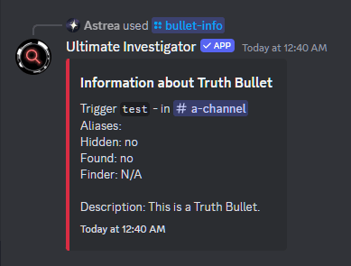

# Ultimate Investigator

<figure markdown>
  
</figure>

Ultimate Investigator is a bot meant to help out investigations with Danganronpa roleplays. More specifically, this helps out with "typical" investigations: investigations where users are expected to find key words to get Truth Bullets.

For example, moderators can:

- Set up Truth Bullets for users to find in specific channels:
<figure markdown>
  { loading="lazy" }
</figure>

- Manage Truth Bullets, including editing and removing them:
<figure markdown>
  { loading="lazy" }
</figure>
<figure markdown>
  { loading="lazy" }
</figure>

- Adjust other settings, like who can trigger Truth Bullets and if a role is awarded to the person who finds the most Truth Bullets:
<figure markdown>
  
</figure>

Then, when Truth Bullet discovery is enabled, users can trigger a Truth Bullet by saying a specific phrase in a channel:
<figure markdown>
  
  <figcaption>Notice how the trigger is "ink", as represented by the underline and the word in codeblocks in the embed.</figcaption>
</figure>

And the bot, as seen above, will reply with the Truth Bullet in the same channel and in a separate channel "Truth Bullets" channel.

To see more information, you can either look at:
- [Using the Bot as a User](using_the_bot.md)
- [The Server Setup Guide](server_setup.md)