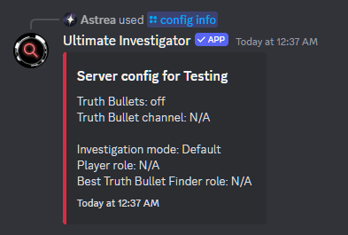
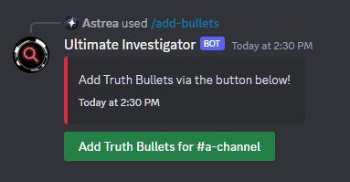
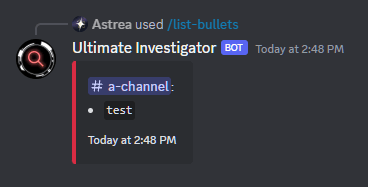
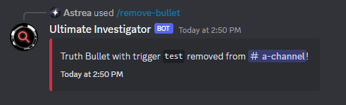

# Server Setup Guide

Setting up Ultimate Investigator is a relatively simple affair. Let's break it down by steps:

### Invite the Bot

This is probably the most simple step. Simply use [this invite link](https://discord.com/api/oauth2/authorize?client_id=843994199187914753&permissions=532576332864&scope=bot%20applications.commands) or use the "Invite Bot" option to the side to do so.

### Setting Up the Config

It's worth running `/config info` first when you set up the bot. This gives you a pretty good idea about what options there are to use for the configuration (admittedly, not many):

<figure markdown>
  
</figure>

Your first priority should be _setting up the player role and Truth Bullet channel._ This can be done pretty easily:

* For the player role, select the `/config player` command, _use the role option_, and use the role you wish to be able to trigger Truth Bullets. It's worth noting that _no other role will be able to use them, not even admins._
* For the Truth Bullets channel, it's a similar process: select the `/config bullet-channel` command, _use the channel option_, and select the channel you want Truth Bullets to go in.

And you're technically ready! However, there are other commands worth noting:

* `/config best-truth-bullet-finder` can be used to set roles given to the people who find the most Truth Bullets. If this is not given, no role will be handed out to those who find the most, though as of right now, a message for who sent the most is still sent.
* `/config toggle` turns on or off triggering Truth Bullets. This'll be important later.

### Setting Up Truth Bullets

#### Adding Truth Bullets

Let's get started by adding Truth Bullets - use `/add-bullets` and select a channel to, well, add a Truth Bullet to a specific channel. This'll pop out a little button that can be used _at any time to add Truth Bullets to that channel._

<figure markdown>
  { loading="lazy" }
</figure>

Once you click that button, a little pop-up will appear, asking you the trigger and a description (supports Discord markdown!) for the Truth Bullet you're adding.

<figure markdown>
  { loading="lazy" }
</figure>

!!! tip "Flexibility with Triggers"
    The trigger is designed to be flexible, so here are a few notes about what you can get away with:
    - You can use multiple words or a single word as a trigger.
    - Triggers are case-insensitive in terms of how they're triggered, so "oven" and "Oven" will act the same.
    - Trigger detection is _not_ word-bound, so "book" trigger will trigger on messages containing "*book*", "*book*s", "*book*shelf", "*book*!", etc., since they all have "book" in them.
    - If you need multiple triggers, take a look at aliases, described later.

Specify those and press send - you should get a message able how that was done successfully!

Truth Bullets are unique _by their trigger by channel_, so while *multiple* channels can have a Truth Bullet with the same trigger, a *single* channel cannot have multiple Truth Bullets with the same trigger.

#### Seeing Current Truth Bullets

After adding Truth Bullets, you probably want to get a good overview of them. Let's use `/list-bullets` to list out the ones we've made so far:

<figure markdown>
  { loading="lazy" }
</figure>

As you can see, it already has a Truth Bullet in it. This command will list out Truth Bullets for every single channel and if they were found - this is a useful reference to have as you make Truth Bullets or even watch over an investigation (Truth Bullets that have been found will be marked as such).

To see a specific Truth Bullet's information, you can use `/bullet-info` with the channel and trigger of the Truth Bullet you want to see:

<figure markdown>
  { loading="lazy" }
</figure>

As you can see, it's pretty basic, but it does list everything you would need to know. Most of these fields are empty (as expected), but we can always reference these later.

#### Editing and Removing Truth Bullets

Editing a Truth Bullet is as simple as using `/edit-bullet` and specifying the channel and trigger of the Truth Bullet you wish to edit. A little pop-up will appear:

<figure markdown>
  { loading="lazy" }
</figure>

As you can see, it already has the old trugger and description in it - you'll be able to edit them from there (though you may want to temporarily move the contents  to a proper text editor to edit things better). When you press submit, the Truth Bullet will be edited with the new trigger and description.

To remove a Truth Bullet, it's as simple as using `/remove-bullet` with the channel and trigger of the Truth Bullet you want to delete:

<figure markdown>
  { loading="lazy" }
</figure>

Removing _all_ Truth Bullets is as simple as running `/clear-bullets`. _This action is irreverable!_

#### Other Commands

* To add an alias (essentially an alternative trigger to trigger the same Truth Bullet), simply use the `/add-alias` command with the channel, trigger of the Truth Bullet, and the alias you wish to add to the Bullet. As you can imagine, `/remove-alias` follows a similar process.
* `/override-bullet` and `/unfind-bullet` are more useful _during_ investigations, as you can imagine, but they simply allow you to either re-define who found a Truth Bullet or un-discover it so its trigger can be triggered once again.
* `/help` is your friend! Use it to find more commands that could be useful to you!

### Starting an Investigation

To start off an investigation with all of your Truth Bullets, simply run`/config toggle` and enable triggering Truth Bullets! Your players will now be able to discover any Truth Bullets you laid out for them. It's suggested that you do this once you got in your first BDA message with the initial hints in, though the bot gives you freedom on how to really do that.

An investigation ends when _all Truth Bullets currently defined has been found_. Till then, keep an eye on your player's progress through `/list-bullets` and give hints as needed. Once all have been found, _the bot will automatically disable triggering bullets._ You'll need to turn on `/config toggle` again if you add a Truth Bullet for people to find them.

_**Truth Bullets are not deleted after an investigation. You MUST do this manually by using `/clear-bullets`!**_  Don't forget to do this - not doing so turns your Truth Bullets into a confusing mess of found and unfound Bullets. If you don't know if you've done it, use `/list-bullets` to verify it.
