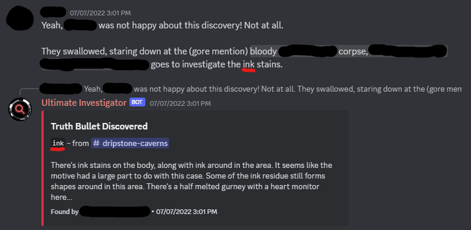

# Using the Bot as a User

## Introduction

(TW for standard Danganronpa BDA topics, like gore and blood.)

You're probably here because a server you're using is using this bot, and you're a bit confused on how to use it for an investigation, and that's okay! The bot essentially automates what a "traditional" investigation done by the staff of a server would do, but this'll guide you on how that works.

Typically, the mods will give you some sort of starting message for an investigation. Let's look at a real world example:

> **A BODY HAS BEEN DISCOVERED!**
>
> \[OC], the Ultimate Mime. The body was discovered in the dripstone caverns, with a stalagmite piercing through the victim's heart in a cruel twist of fate. The body is positioned in a way that makes you think it could have been an accident... Ink and blood stains their body, maybe it's a good idea to look at those a little closer.

As you can see, this is a pretty typical BDA message. However, in it contains hints about **key phrases** - phrases that are needed to trigger a new Truth Bullet.

## Key Phrases

Key phrases can be a lot of things - it can be a body, a piece of paper, the trash can, etc. That may sound vague, but it'll make sense once we take a closer look at this message.

Well, we already know we're in the dripstone caverns (I mean, we had to walk here), so we can ignore that, but the _ink_ and _blood_ is definitely something to look into (the stalagmite has no Truth Bullet associated with it in this case).

We want to investigate the _ink_ first - after all, it's the first item in our little list! The question is how to investigate that with the bot... and it's actually really simple!

All you need to do is send a message with the word "ink" (case-insensitive) somewhere in it in the current channel. For example, it could look like these:

> The _ink_ looked out of place for this murder. I decided to take a look at it.
>
> "You know, that _ink_ is kind of weird, huh?"
>
> Ink (OOC Note: Yes, this simple example works - after all, it does have the word "ink." Try not to do this though - it ruins the fun of investigating for everyone.)

<figure markdown>
  
  <figcaption>The message that actually triggered the Bullet, in this case.</figcaption>
</figure>

Usually, a staff member would step in to show a Truth Bullet related to the ink, but in this case, the bot will reply instead with something like this in both the channel you're in and your Truth Bullets channel:

And that's it - you've investigated the ink! The key phrase here was "ink" - the staff set it up so that the bot would do this with that phrase. You can attempt to say multiple phrases, but the bot will only do one - best to space them out, or even let other players do them for you.

You could investigate the rest of the suspicious things in the same way. Things like "\[My OC] started to look at the _blood_." would trigger a new Truth Bullet, and there are some key phrases in the above example image to find even more of them. The idea is to keep following the little hints about key phrases/important things to investigate until you've found them all, which the bot will note if you've done so in the Truth Bullets channel.

## Notes

* It's worth noting that depending on who set up the Truth Bullets, you may be able to get away with using _alternative phrases_ to trigger a Truth Bullet. These are called _aliases_, and they're handy in case, for example, you have to face the differences between American and British English.
* There can only be one Truth Bullet with a specific key phrase _per channel._ You may need to look around in other channels to find everything!
* The final "All Truth Bullets have been found" message will also include who found the most Truth Bullets, and if your staff members set it up, it'll also give a special role to them.
